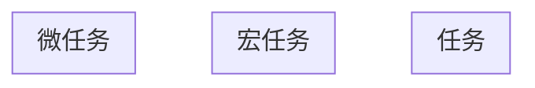
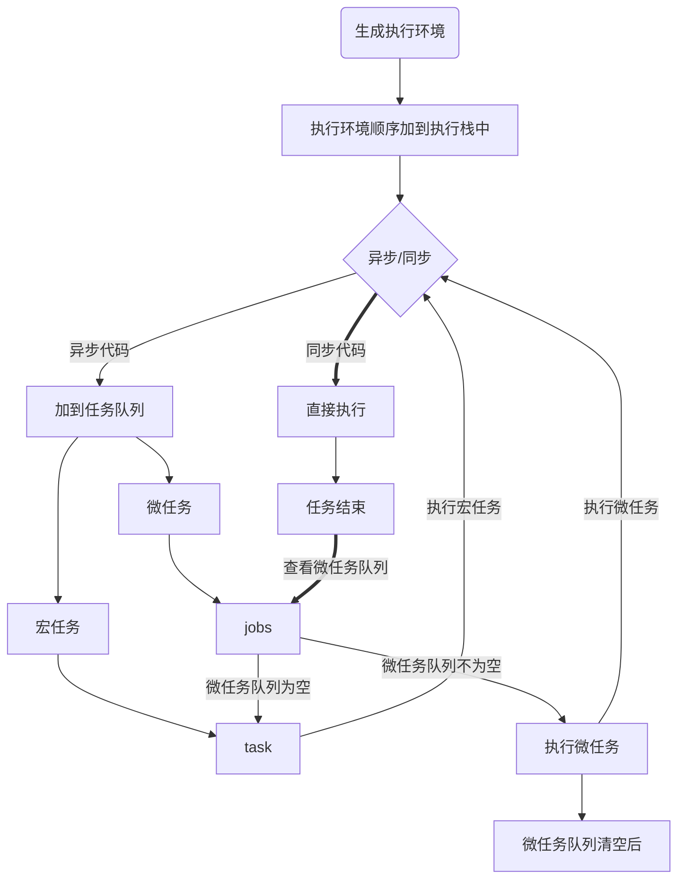
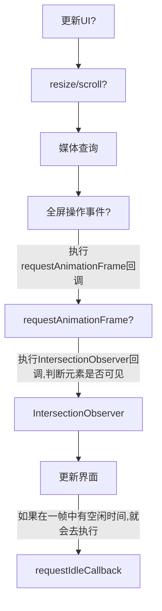

执行一个宏任务（栈中没有就从事件队列中获取）

执行过程中如果遇到微任务，就将它添加到微任务的任务队列中

宏任务执行完毕后，立即执行当前微任务队列中的所有微任务（依次执行）

当前宏任务执行完毕，开始检查渲染，然后GUI线程接管渲染

渲染完毕后，JS线程继续接管，开始下一个宏任务（从事件队列中获取）

# Event Loop

很多人不知道的是，重绘和回流其实和 Event loop 有关。

1. 当 Event loop 执行完 Microtasks 后，会判断 document 是否需要更新。因为浏览器是 60Hz 的刷新率，每 16ms 才会更新一次。
2. 然后判断是否有 `resize` 或者 `scroll` ，有的话会去触发事件，所以 `resize` 和 `scroll` 事件也是至少 16ms 才会触发一次，并且自带节流功能。
3. 判断是否触发了 media query
4. 更新动画并且发送事件
5. 判断是否有全屏操作事件
6. 执行 `requestAnimationFrame` 回调
7. 执行 `IntersectionObserver` 回调，该方法用于判断元素是否可见，可以用于懒加载上，但是兼容性不好
8. 更新界面
9. 以上就是一帧中可能会做的事情。如果在一帧中有空闲时间，就会去执行 `requestIdleCallback` 回调。

> 当前宏任务执行完毕,开始检查渲染,然后GUI线程接管渲染,渲染完毕后,JS线程继续接管,开始下一个宏任务(从事件队列中获取)

